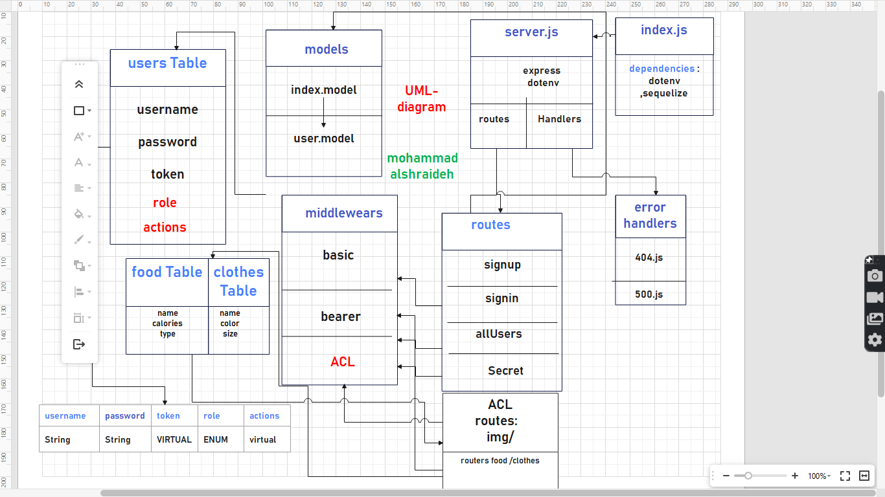

# auth-api

[heroku app](https://auth-api-mnsh.herokuapp.com/)

[pull request](https://github.com/mohammadsh96/auth-api2/pull/1)

[github actions](https://github.com/mohammadsh96/auth-api2/actions)

## UML

## WRRC

